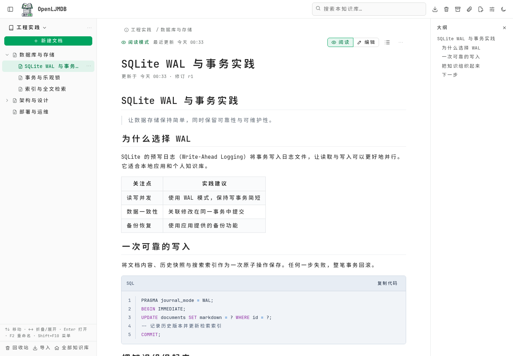
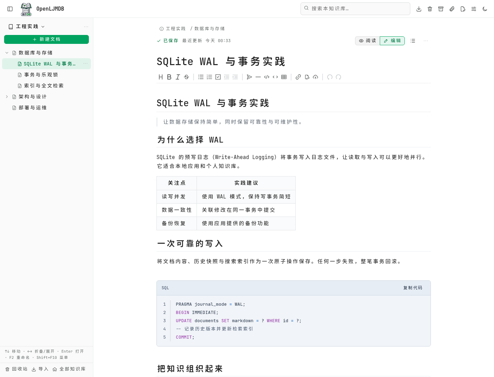
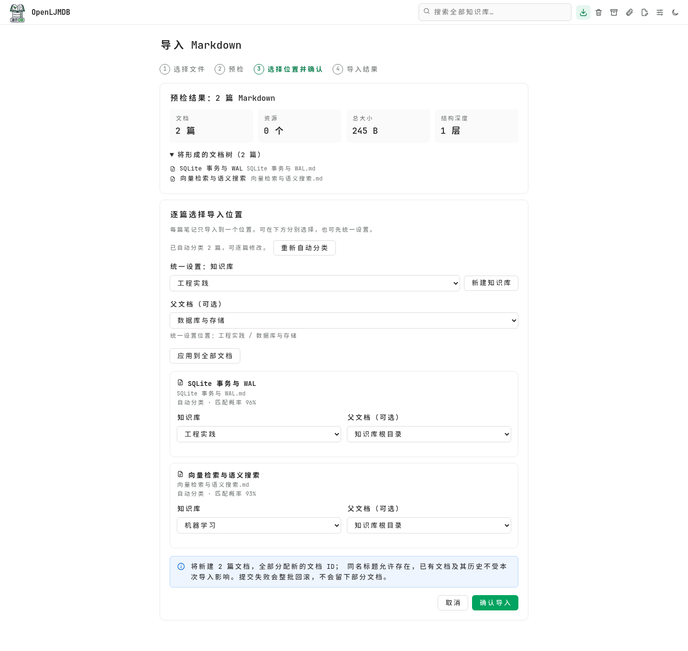

# OpenLJMDB

**A local Markdown knowledge base with automatic classification during import.**

[简体中文](README.md) | **English**

OpenLJMDB organizes scattered notes into knowledge bases and document trees. It provides Markdown editing and reading, full-text search, attachments, revision history, a recycle bin, import and export, and backup and restore. Built with Vue 3, TypeScript, Go, and SQLite, it stores data locally and requires no external database. Everyday editing, reading, and search work offline; automatic import classification connects to an external classification service when enabled.

[Automatic classification](#automatic-import-classification) · [Features](#features) · [Screenshots](#screenshots) · [Quick start](#quick-start) · [Classification configuration](#configure-automatic-classification) · [Development and checks](#development-and-checks)

## Automatic import classification

When importing Markdown files in bulk, OpenLJMDB uses each note's **full content and title, together with the names and descriptions of existing knowledge bases**, to recommend a destination knowledge base and reduce manual sorting.

```text
Select Markdown files → Import preview → Recommended knowledge bases and match probabilities
                                                        ↓
                                     Review or adjust each destination → Confirm import
```

- **Classify by content:** Existing knowledge bases serve as candidate categories. The knowledge base with the highest probability returned by the model is selected by default. Create knowledge bases with clear topic descriptions before importing.
- **Process multiple files:** Select several `.md` / `.markdown` files at once, then review classification progress and each file's match probability on the confirmation screen.
- **Adjust destinations:** Recommendations place notes at the root of a knowledge base. Before importing, you can change each note's knowledge base and parent document, or apply one destination to all notes.
- **Control the process:** Stop or retry classification. If the service is unconfigured, fails, or times out, you can still choose destinations manually and import the files.
- **Enable it when needed:** Classification is off by default. Enable “导入自动分类” (automatic import classification) under “设置 → 导入” (Settings → Import) and save. See [configuration](#configure-automatic-classification) below.

ZIP archives preserve their document hierarchy and use one destination for the entire archive; they do not participate in automatic classification. Recommendations have no minimum probability threshold, so review the suggested destinations before importing. This feature does not reorganize or move existing notes.

> When classification is enabled, imported document titles and full Markdown content, along with the IDs, names, and descriptions of existing knowledge bases, are sent to the configured classification service. The API key is read only from backend environment variables; it is not stored in the frontend, database, or application backups.

## Features

| Feature | Description |
| --- | --- |
| Knowledge bases and document trees | Multiple knowledge bases, descriptions, nested documents, child document creation, renaming, and deletion |
| Markdown editing and reading | Vditor instant-rendering editor, dedicated reading view, outline navigation, syntax highlighting, KaTeX formulas, and Mermaid diagrams |
| Autosave and drafts | Save status, local IndexedDB drafts, revision conflict detection, and manual merging |
| Full-text search | Search titles and content within a knowledge base, with a Chinese substring fallback, highlighted matches, and result navigation |
| Images and attachments | Upload, paste, or drag in images and attachments; manage references and clean up unreferenced attachments |
| History and recycle bin | View and restore revisions; recover deleted content from the recycle bin |
| Import and automatic classification | Bulk Markdown previews, per-file classification and destination review, and ZIP imports that preserve structure |
| Content export | Markdown, HTML, and ZIP archives with resources for migration and offline reading |
| Full backup and restore | Preserve documents, attachments, revisions, the recycle bin, and settings; validate restores and retain a pre-restore copy |
| Appearance and layout | Light, dark, or system theme; collapsible sidebar and responsive layout |

## Screenshots

These screenshots show the running application with a separate demo knowledge base. Recommendations in the automatic classification screenshot were generated by a local mock classification service to demonstrate the workflow; they are not evaluation results from a real model. See [docs/images/README.md](docs/images/README.md) for screenshot details. The application UI currently uses Chinese.

### Knowledge base workspace

The document tree, Markdown reading view, and outline appear together in one workspace.



### Markdown editing

Write with Vditor's instant-rendering editor, formatting toolbar, and visible save status.



### Automatic classification during Markdown import

Review recommended knowledge bases and match probabilities during bulk import, then adjust each note's destination before submitting.



## Quick start

### Requirements

- **Go 1.27.1 or later**, matching [backend/go.mod](backend/go.mod).
- **Node.js 24 LTS (recommended) or 22.x (at least 22.12)**, plus npm.
- **Git**; the shortcut commands below also require `make`. Use a recent version of Chrome, Edge, Firefox, or Safari.

An internet connection is needed to install backend and frontend dependencies initially. After building, core knowledge base features work offline. Automatic classification requires a separately configured, available classification service.

### Build and run from source

Run in a terminal:

```bash
git clone https://github.com/liangjie6/OpenLJMDB.git
cd OpenLJMDB

npm --prefix web ci
make build
make web-build

./backend/dist/ljmdb --data-dir ./data --web-dir ./web/dist --no-open
```

Open **[http://127.0.0.1:8080](http://127.0.0.1:8080)**. The backend serves both the frontend and the `/api/v1` API. Data is stored in `data/` at the project root, separate from build artifacts. Press Ctrl+C to shut down normally.

If `make` is unavailable, replace the two build commands with:

```bash
go -C backend build -trimpath -o dist/ljmdb ./cmd/ljmdb
npm --prefix web run build
```

On Windows, change the output filename to `dist/ljmdb.exe`, then run `./backend/dist/ljmdb.exe` with the same arguments.

### First use

The Chinese labels below match the current application UI.

1. Create knowledge bases, such as programming, research, and personal notes, and add a topic description to each.
2. Create a document to start writing, or open “导入” (Import) to select Markdown files or a ZIP archive.
3. To use automatic classification, configure the backend classification service, then enable “导入自动分类” (automatic import classification) in settings.
4. Review document destinations on the import confirmation screen and confirm the import. Regularly create a full backup through “备份与恢复” (Backup and Restore).

## Configure automatic classification

The current implementation uses the fixed model **`decision-model-preview`** and the dedicated **`POST /v1/systemone`** endpoint. Your service must support that endpoint's classification request and response format. A standard Chat Completions endpoint cannot be substituted directly.

| Environment variable | Description |
| --- | --- |
| `LJMDB_DECISION_BASE_URL` | Classification service root URL, such as `https://your-classifier.example.com`; omit `/v1`. There is no default service URL. |
| `LJMDB_DECISION_API_KEY` | Classification service API key, provided only to the backend process |

### Run the backend directly

Stop any running backend, set the environment variables in the same Bash terminal, and restart it:

```bash
export LJMDB_DECISION_BASE_URL='https://your-classifier.example.com'
read -r -s -p 'Classification service API key: ' LJMDB_DECISION_API_KEY
printf '\n'
export LJMDB_DECISION_API_KEY

./backend/dist/ljmdb --data-dir ./data --web-dir ./web/dist --no-open
```

Replace the example domain with your service URL. The hidden key input keeps the key out of command history. After starting the backend, open “设置 → 导入” (Settings → Import), enable “导入自动分类” (automatic import classification), save, and import Markdown files.

### Existing systemd deployment

```bash
sudo bash deploy/configure-classifier.sh https://your-classifier.example.com
```

The script reads the key with hidden input, writes the environment configuration to the root-only file `/etc/openljmdb/classifier.env`, supplies it to the backend through systemd, and restarts the service. See [deploy/README.md](deploy/README.md) for deployment prerequisites and update instructions.

## Development and checks

Use two terminals for backend and frontend development. Run all commands from the project root.

In the first terminal, start the backend:

```bash
make build
./backend/dist/ljmdb --data-dir ./data --no-open
```

In the second terminal, start the frontend:

```bash
npm --prefix web ci
npm --prefix web run prebuild
npm --prefix web run dev
```

`prebuild` copies Vditor dependencies into the frontend's local assets directory and must run before the first development startup. `npm run build` runs this step automatically.

Open **[http://localhost:5173](http://localhost:5173)**. Vite proxies `/api` to `http://localhost:8080`. For production, use `--web-dir` as shown above to serve the frontend and API from the same origin.

| Command | Purpose |
| --- | --- |
| `make build` | Build the Go backend to `backend/dist/ljmdb` |
| `make web-build` | Type-check and build the frontend to `web/dist` |
| `make test` | Run backend tests |
| `make check` | Run `go vet` and backend race tests |
| `npm --prefix web run type-check` | Run frontend TypeScript checks |
| `npm --prefix web test` | Run frontend Vitest tests |
| `make release` | Build backend release archives and checksums for Linux, macOS, and Windows on amd64 / arm64 |

`make release` packages only the backend. Build the frontend separately and serve it with `--web-dir`. Cross-compilation does not mean every target platform has passed runtime acceptance testing.

## Project structure

```text
OpenLJMDB/
├── backend/               # Go API, SQLite, migrations, classification calls, and backend tests
│   ├── cmd/ljmdb/         # Application entry point
│   └── internal/          # Configuration and application logic
├── web/                   # Vue 3 + TypeScript + Vite + Vditor
│   ├── src/               # Pages, components, state management, and API client
│   └── public/            # Icons, fonts, and local assets
├── docs/                  # Product, architecture, API, acceptance, and screenshots
├── deploy/                # Nginx / systemd templates, update and classification scripts
├── README.md              # Chinese documentation
├── README.en.md           # English documentation
└── Makefile               # Root build and check commands
```

The backend stores and searches content with SQLite WAL and FTS5, uses Markdown as the source format, and renders it with Lute. The frontend uses Pinia, Vue Router, and Vditor. Editor and reading resources are included in the frontend build.

## Data and backups

- `--data-dir <path>` sets the data directory. If omitted, the application uses the system's user data directory and prints its actual path at startup.
- `--portable` uses a `data/` directory beside the executable. It cannot be combined with `--data-dir` or `LJMDB_DATA_DIR`.
- The default listening address is `127.0.0.1:8080`. Change the port with `--port`. See [backend/README.md](backend/README.md) for more options.

```text
<data-dir>/
├── knowledge.db           # Documents, structure, history, recycle bin, settings, indexes, and tasks
├── uploads/               # Attachment files
├── backups/               # Full backups and pre-restore copies
├── tmp/                   # Import previews and temporary task files
├── runtime/               # Restore coordination data
└── logs/                  # Application logs
```

Content exports are intended for sharing, migration, and offline reading. Full backups preserve original IDs, history, the recycle bin, and persistent settings. Browser IndexedDB drafts are not included in backend backups. While the application is running, use its built-in backup feature instead of copying the active SQLite database directly.

## More documentation and contributing

The supporting documents below are primarily in Chinese.

- [Backend operation, command-line options, and API conventions](backend/README.md)
- [Frontend development](web/README.md)
- [Local deployment, updates, and classification service configuration](deploy/README.md)
- [Product, architecture, data model, and acceptance documentation](docs/README.md)
- [Backend acceptance records](docs/07-后端验收记录.md) and [issue-fix verification](docs/08-问题修复验收.md)
- [Backend third-party notices](backend/THIRD_PARTY_NOTICES.md)

The project is designed as a local, single-user knowledge base. It currently has no login authentication, and the document tree does not yet support drag-and-drop movement or reordering. Planned features in design documents may differ from delivered functionality; refer to the current implementation and acceptance records.

Report problems through [Issues](https://github.com/liangjie6/OpenLJMDB/issues) or submit a pull request. Include your operating system, Go / Node.js versions, reproduction steps, and sanitized logs when reporting a problem. Run the relevant backend and frontend checks after changing code.
