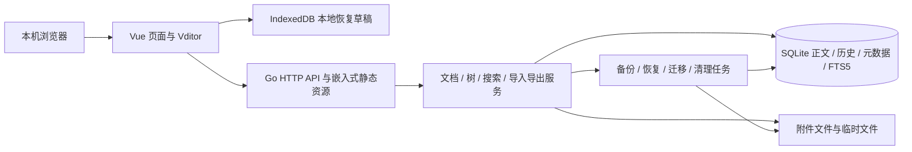

# 技术架构与运行部署

版本：v1.0；日期：2026-10-04；状态：待实施设计。

本文确定运行边界、模块职责、可靠性机制和交付方式。具体表结构与接口见 [数据模型与接口设计](03-数据模型与接口设计.md)，发布验证见 [开发计划与验收标准](05-开发计划与验收标准.md)。本文中的参数是初始设计值，性能表现和依赖版本需要通过原型验证。

## 1. 架构目标与边界

1. 在用户自己的电脑上运行，不依赖云数据库、搜索服务或 CDN。
2. 每个支持的平台分别发行一个可执行文件，前端及运行期资源嵌入 Go 二进制；数据保存在外部数据目录。
3. 默认只监听 `127.0.0.1:8080`，单用户、免登录；不以多用户权限或实时协作为第一版目标。
4. 正文、文档结构、附件和历史可以完整备份恢复；更换二进制不能覆盖用户数据。
5. 保存失败、进程异常、磁盘故障应明确报告；不能把“请求已发送”当成“数据已保存”。
6. 后续可以增加局域网访问、中文分词、标签和反向链接，但不为这些功能预先部署独立服务。

“单二进制”不等于数据也在二进制中，不等于同一个文件能跨 Windows、macOS、Linux 运行。局域网访问和“完全无网络依赖”也不冲突，前者是用户主动开放的访问方式，后者指应用不依赖外部服务。

## 2. 总体架构



浏览器草稿是恢复手段，SQLite 中确认提交的正文才是服务端持久数据。读取、导出和搜索不能依赖某一个浏览器的草稿。

### 2.1 技术选型

| 层次 | 选型或候选 | 约束与验证 |
|---|---|---|
| 前端 | Vue 3、TypeScript、Vite、Vue Router、Pinia | 构建产物包含所有运行期资源；版本锁定 |
| 编辑器 | Vditor，首版开放即时渲染 `ir` 模式 | 验证复杂 Markdown 无损加载保存；其他模式后续开放 |
| 后端 | Go 标准 HTTP 能力或轻量路由库 | 路由库由实现阶段选定，不能影响服务层边界 |
| 数据库 | SQLite，WAL 模式 | 外键、等待超时、一致备份、schema 迁移必须落实 |
| SQLite 驱动 | 优先评估纯 Go 驱动，保留 CGO 驱动方案 | 以 FTS5、备份支持、平台构建及性能原型结果决定 |
| Markdown | 优先评估兼容版本 Lute | 与 Vditor 的扩展语法和标题锚点对齐，不能默认任意版本一致 |
| 搜索 | FTS5 + 参数化中文子串检索回退 | 首版不承诺语言学意义上的中文分词 |
| 公式 / 图表 | KaTeX、Mermaid 浏览器渲染 | 本地资源，严格安全配置；HTML 导出另行验证 |
| 打包 | Go `embed` 嵌入前端和依赖资源 | 动态加载路径不能指向 CDN；每个平台产物独立验证 |

优先评估 `modernc.org/sqlite` 等纯 Go 驱动；名称只是候选，不是已验证结论。如果采用 CGO，必须记录构建环境、链接方式与运行库依赖，并验证目标系统是否仍满足单文件运行目标。

### 2.2 后端模块职责

| 模块 | 责任 | 不承担的责任 |
|---|---|---|
| HTTP 层 | 参数解析、请求大小限制、状态码、错误响应、Origin/Host 检查 | 不直接拼接 SQL 或遍历磁盘删除目录 |
| 文档服务 | 保存版本校验、历史快照、引用更新、删除恢复 | 不让客户端指定物理文件路径 |
| 树服务 | 首版创建与恢复校验，P1 移动及同级重排 | 不信任前端排序序号 |
| 渲染服务 | Markdown 转换、HTML 净化、纯文本提取、版本化缓存 | 不把缓存当作正文来源 |
| 搜索服务 | 查询规范化、FTS/回退检索、评分、片段生成 | 不接受未经处理的任意 FTS 查询语法 |
| 附件服务 | 上传暂存、类型检测、稳定 ID、引用与下载 | 不公开整个上传目录 |
| 数据流转服务 | 导入预检、链接重写、导出资源收集 | 不把普通导出当作完整备份 |
| 维护服务 | 备份恢复、schema 迁移、清理候选、重建索引 | 不在后台自动覆盖失败备份或未确认清理项 |

所有数据库写入经过统一事务入口；导入、删除、恢复等多步骤操作由服务层协调。数据库提交和文件系统操作不能假装组成一个原子事务。

## 3. 建议项目结构

```text
LJMDB/
├── backend/
│   ├── cmd/ljmdb/main.go
│   ├── internal/backend/ # API、数据、渲染、导入导出与迁移
│   ├── internal/config/  # 启动参数与数据路径
│   ├── THIRD_PARTY_NOTICES.md
│   ├── licenses/         # Go 依赖授权
│   ├── go.mod
│   └── scripts/          # 后端构建、发布与离线检查
├── web/
│   ├── src/
│   ├── public/vendor/   # 本地编辑器及运行期资源
│   └── dist/            # 构建产物，不保存用户数据
├── deploy/              # 前后端部署模板与发布脚本
└── docs/
```

后端源代码、依赖锁文件、资源授权说明和构建脚本集中在 `backend/`；前端源代码集中在 `web/`。数据目录、备份、日志和真实用户内容不得纳入源码仓库。

## 4. 数据目录与启动生命周期

### 4.1 数据目录选择

默认使用操作系统用户数据目录，例如 Linux 用户数据路径、macOS Application Support、Windows Local AppData 下的 `LJMDB` 子目录。由标准平台 API 解析，不硬编码用户名。

显式支持 `--data-dir`，并提供可执行文件同级目录的便携模式。便携模式需验证可写性；不因默认目录失败而静默创建第二套数据库。

```text
<data-dir>/
├── knowledge.db
├── knowledge.db-wal / knowledge.db-shm   # SQLite 运行期文件
├── uploads/<ID前两位>/<附件ID>/blob      # 不可变附件内容
├── tmp/                                 # 上传、导入、备份临时文件
├── backups/                             # 可选的本机备份副本
├── logs/                                # 有容量上限的运行日志
├── runtime/restore-state.json            # 位于待替换数据集之外的恢复日志
└── runtime.lock                         # 数据目录独占锁，不是秘密
```

附件原始名称只保存在元数据中，不用于决定物理路径。同一附件 ID 的内容写入后不原地修改，替换文件产生新 ID，便于快照、历史和引用共享。

### 4.2 启动步骤

1. 解析命令行与环境变量，确定唯一数据目录。
2. 验证可写、剩余空间和数据目录锁；同目录已有实例时不再打开数据库写入。
3. 打开数据库，设置连接参数，检测 schema 版本和 FTS5 能力。
4. 需要升级时先生成升级前备份，再执行内置迁移；失败不进入正常服务状态。
5. 检查未完成文件任务，报告异常并安排幂等恢复，不进行无条件删除。
6. 绑定 `127.0.0.1` 与配置端口；绑定失败明确报告原因，不意外改为所有接口。
7. 通过 readiness 检查后打开浏览器，输出访问地址和实际数据路径。

重复启动检测应使用操作系统文件锁，不能只判断锁文件是否存在。第二个实例能可靠识别同一实例时可以打开其页面，否则提示退出。端口被其他程序占用时提供选择其他端口的说明，不自动杀死占用进程。

### 4.3 配置与设置

启动参数优先于环境变量，环境变量优先于默认值。数据目录和监听地址属于启动设置，首版设置页只读展示并提供命令行修改指引，不在旧数据库中保存新数据目录。变更参数后重新运行程序；历史保留数量等产品设置保存到数据库设置表，界面偏好可按作用域本地保存。

| 参数 | 默认设计 | 说明 |
|---|---|---|
| `--host` | `127.0.0.1` | 非回环绑定首版拒绝或提示尚未支持 |
| `--port` | `8080` | 前端请求使用相对路径，不固化端口 |
| `--data-dir` | 平台用户数据目录 | 界面显示并提供打开目录入口 |
| `--portable` | 关闭 | 与显式数据目录的冲突应报告 |
| `--no-open` | 关闭 | 关闭自动打开浏览器，方便脚本运行 |

运行日志不记录正文、附件内容、密码或会话令牌。关闭浏览器不等于后端退出，应提供明确的退出方式；后台进程存在时不能按“已退出应用”执行目录复制备份。

## 5. SQLite 与事务

### 5.1 首版连接策略

首版采用一个数据库连接，简化个人规模的写入协调。WAL 有助于数据库层读写协调，但一个连接仍会串行执行操作；不要据此宣称应用已经支持任意读写并行。

初始化时设置 `foreign_keys=ON`、`journal_mode=WAL`、`busy_timeout` 和 `synchronous`。初始等待超时可设 5 秒；个人数据优先评估 `synchronous=FULL`，若调整应记录可靠性取舍与基准。后续增加连接池时，每个连接都需正确应用连接级配置。

### 5.2 写入规则

- 数据库事务尽量短，文件复制、ZIP 打包和浏览器渲染不在事务中等待。
- 保存同时提交标题、Markdown、revision、历史、附件引用和搜索源字段；FTS 由触发器在同一事务同步。
- 数据库失败时整体回滚；接口只在提交成功后返回成功。
- 创建和恢复更新树版本并校验结构；P1 节点移动同时校验父节点并更新顺序；根节点深度为 1，初始保护上限为 32 层。
- 软删除不触发物理文件删除；清空回收站由引用检查和文件任务机制继续处理。

本地 SQLite 数据目录不应放在跨主机共享的网络文件系统上。网盘同步正在使用的数据库也不能视为一致备份或多设备同步方案。

## 6. 保存、草稿和历史

自动保存采用 3 秒防抖和 30 秒最长间隔，标题与正文作为一个快照保存。同一文档只有一个保存请求在途；请求期间的新修改留在编辑器并在下一次请求发送。

保存请求包含 `expected_revision`，后端用带版本条件的更新保证冲突时不覆盖。`409` 后保留本地和服务端两份内容，暂停自动写入，提供手动比较、复制为新文档或明确确认后的覆盖。

IndexedDB 草稿以 `instance_id + document_id + editor_session_id` 区分，包含基础 revision、基础 data_epoch、标题、Markdown 和本地更新时间。各标签页使用不同编辑会话 ID，关闭后仍保留该会话待恢复草稿，不会互相覆盖。`instance_id` 是数据集合标识，应由健康接口返回并持久保存在备份中；切换数据目录或不同实例时不能错用同一端口留下的草稿。

健康接口同时返回 `data_epoch`：初始化和每次完整恢复时生成新 UUID，所有状态修改请求携带 `X-Data-Epoch`。旧世代请求返回 `409 DATA_EPOCH_CHANGED` 并暂停写入，浏览器重新加载与比较后才可继续；不能自动换成新 epoch 重发旧正文。这个世代保护用于防止恢复备份后 revision 数值再次出现，不能用 schema 版本替代。

客户端成功响应仅确认该请求携带的快照已保存。若用户在请求期间继续编辑，不能把新内容也标记为已保存；对应草稿只能在确认内容一致后清除。

草稿写入采用较短节流，具体频率由浏览器性能原型决定；IndexedDB 不可用或容量不足时明确提示恢复保障降低。关闭页面时的请求和 `beforeunload` 都只是辅助，不保证完成。

历史默认每篇最多 100 条，可配置。按 5 分钟窗口首次修改保留变更前快照，恢复历史前强制保存当前快照；手动保存可以触发明确快照。revision 每次成功保存递增，但不是每个 revision 都永久保留。裁剪历史时同步解除对应附件引用。

## 7. Markdown、渲染与离线资源

### 7.1 统一正文规则

- Markdown 是可编辑与导出的来源；HTML 和 `search_text` 可重建。
- 标题单独存储，导出清单记录标题；展示页不重复自动插入正文 H1。
- 渲染配置明确 GFM、脚注、标题 ID、代码、公式和 Mermaid 支持范围。
- 缓存记录渲染器及配置版本；升级后按需重建，不静默修改 Markdown。
- 对复杂表格、HTML 和编辑模式转换建立固定语料测试，不能只验证普通段落。

### 7.2 安全渲染

最终 HTML 做白名单净化，限制 URL 协议与主动内容；预览和阅读使用一致策略。代码与搜索片段先转义，再插入受控高亮标记。KaTeX 不启用信任模式，Mermaid 使用严格配置并禁用不必要的交互。

外部图片和链接由用户内容引入，应用不能宣称它们必然离线可见。外部图片应提示依赖网络，并提供后续本地化能力；远程图片自动抓取不进入首版默认行为。

### 7.3 资源打包

检查 Vditor 的 CDN 配置、表情、主题、字体以及按需加载的公式和图表依赖。前端构建成功不代表这些资源已嵌入，必须在断网条件下逐项打开相关功能验证。

HTML 导出首版采用 HTML + 资源 ZIP；包含本地脚本、样式、图片以及相应渲染结果或依赖，实际通过 `file://` 打开验证。不能依赖模块跨域请求或在线字体。若某个图表类型无法离线导出，发布前明确限制或移除承诺。

## 8. 搜索实现

首版英文和代码词使用 FTS5；中文子串和短词有参数化 `LIKE` 回退，用户输入中的 `%`、`_` 按字面转义。查询统一排除回收站，并支持知识库过滤和分页。

FTS 的索引来源是标题与 Markdown AST 提取的检索文本，不是 HTML 标签。检索文本保留普通段落、代码块、公式和 Mermaid 源表达式、链接文字及目标 URL，避免只搜索渲染后的可见文字；本地附件存储 ID 可不参与检索。英文走 BM25 等相关性排序；回退结果按标题优先、正文命中次之排序。不同评分不能直接混加，应去重并采用明确的分组排序规则。

标题锚点仅用于大纲跳转；全文命中打开文档后进行关键词高亮与逐项跳转。首版不承诺任意词命中的源码精确位置映射。

真正中文分词需先确认驱动扩展能力、词典分发、索引与查询一致性，再替换基础方案。FTS5 trigram 的少于 3 字符全文查询限制意味着它不能独立解决常见两字词检索。

索引触发器与应用层不得各自维护一套 FTS 写入逻辑。初始化旧数据时显式 rebuild，维护入口可以重建索引和检查一致性。

## 9. 附件与文件一致性

### 9.1 上传

请求限制大小，流式写入数据目录内的临时文件，检测类型并生成随机附件 ID。完成文件写入和必要刷新后，创建 pending 元数据，再原子改名到正式位置并将状态改为 ready；最终成功才返回地址。文件提交成功但数据库失败时保留可恢复状态或识别孤立文件，不返回假成功。

文件地址使用 `/api/v1/attachments/{id}/content`，按 ID 查元数据后读取；不通过用户输入拼接任意路径。原始名称用于展示和下载响应，不能包含影响响应头的控制字符。

主动内容如 HTML、脚本、部分 SVG 默认作为下载附件提供；图片展示类型白名单与实际内容检测相结合。附件服务不允许路径穿越或跟随数据目录之外的符号链接。

初始资源限额如下，全部是待原型验证的保护值；客户端展示实际生效限制，服务端必须独立校验。

| 项目 | 初始值 | 超限行为 |
|---|---|---|
| 文档或知识库标题 | 200 个 Unicode 字符 | 字段校验拒绝，保留输入 |
| 单篇 Markdown | 10 MiB UTF-8 字节 | 拒绝保存或导入该包，不截断正文 |
| 单个上传附件 | 50 MiB | 流式中止并清理暂存，保留其他正文 |
| 上传 ZIP | 500 MiB | 上传及预检拒绝 |
| ZIP 实际展开总量 | 1 GiB | 按实际输出字节计数，中止预检 |
| ZIP 文件条目 | 10,000 | 中止预检；重复规范路径拒绝 |
| 文档树深度 | 32 层，根为 1 | 拒绝创建、导入、恢复或 P1 移动 |
| 搜索关键词 | 200 个 Unicode 字符 | 拒绝过长查询 |
| 分页大小 | 默认 20，最大 100 | 拒绝非法值，不无上限返回 |

完整备份包不套用普通内容 ZIP 的 500 MiB 上限，应按磁盘空间与备份 manifest 进行独立流式校验；备份可能包含多份历史和大量附件，不能因为普通导入保护值而无法恢复正常数据。限额调高需要容量验证，不允许把大文件全部读入内存。第一版缺失本地资源视为导入预检错误；无法解析的外部链接保留并报告。

### 9.2 引用与清理

当前正文、回收站正文、历史快照均可能持有附件引用。历史恢复和导出必须能够取得对应资源，清理不可只检查当前未删除文档。

首版所有未引用附件先列为清理候选，由用户确认；未绑定上传不自动删除，以保护尚未提交的浏览器草稿。管理界面提示：服务端无法知道所有浏览器中未上传的草稿引用，清理前应处理本地草稿。

确认清理后，在数据库事务中再次检查引用并标记 `pending_delete`；随后拒绝新增引用并执行物理删除，成功后更新状态。失败记录可重试任务；任务幂等，重启后可继续。不能在“检查无引用”和“删除文件”之间允许新引用进入。

## 10. 导入、导出、备份与恢复

### 10.1 导入导出

导入先在临时目录预检 ZIP 路径、展开大小、数量、类型、内部链接及冲突，不直接解压到数据目录。确认后分配新 ID，重写引用，提交文档树与附件元数据；失败回滚，已写文件按任务清理。

应用自己的导出包有 manifest 和资源映射；通用 Markdown 没有完整元数据时以文件路径表达树结构。普通导入产生新的文档 ID，不把外部包中的 ID 当作覆盖本地数据的授权。

导出在一致的数据库读取快照中收集正文、树与资源清单，阻止相关附件在打包期间物理删除。父节点有正文又有子节点时使用目录加 `index.md`，实际目录名加 ID 后缀避免同名覆盖。

### 10.2 在线备份

首版采用易于验证的一致性方案：进入维护状态、暂停新写入与文件清理、等待在途操作结束，再生成数据库快照并复制不可变附件。写入请求返回可识别的维护错误，前端保留草稿；备份完成或失败后解除维护状态。

数据库快照使用驱动支持的 Backup API 或经验证的 `VACUUM INTO`，不能直接复制正在使用的 `.db`，也不能认为先 checkpoint 就足以保证后续并发复制安全。

备份 manifest 包含格式版本、应用版本、schema 版本、实例 ID、数据库与附件校验和。完成校验后原子生成最终备份文件；失败的临时产物不能显示为成功备份。需要降低暂停时间时再设计分阶段快照，首版不提前引入复杂增量备份。

### 10.3 恢复

恢复前预检格式、schema 支持范围、哈希和数据库完整性。确认覆盖后先备份当前数据，暂停服务写入并关闭数据库连接，在同一文件系统中切换准备好的数据库与 uploads 等持久数据，再重开数据库、生成新的 data_epoch 并检查。保留承载目录及其文件锁，不通过重命名整个带锁目录允许第二实例进入。

切换失败必须能恢复原数据，不能先删除原数据库与附件再尝试解压。恢复完成要求浏览器重新加载，避免原会话的旧 revision 和草稿自动写入恢复后的数据库；草稿仍需用户确认后处理。后台重开数据库即可，不要求自动重启应用进程。

恢复操作的进度及切换日志保存在不参与数据替换的 `runtime/restore-state.json`，由同目录文件锁保护；普通任务仍存 operation_jobs。恢复期间 HTTP 维护入口保持可查询，以独立状态返回恢复任务结果。否则被替换的数据库会丢掉正在轮询的任务。多文件切换不是一次文件系统原子操作，阶段日志和回退流程必须覆盖切换中异常退出。

手工备份的最低规则是正常退出后复制整个数据目录。普通文档导出不包含全部历史、回收站和设置，不能替代完整备份。

## 11. 本地安全与后续局域网模式

本机模式校验允许的 Host 和写操作 Origin，限制跨站请求，不使用宽泛的 `Access-Control-Allow-Origin: *`。文件上传、Markdown 净化和路径检查在免登录模式下仍然有效。

后续局域网模式必须显式开启：密码采用可靠哈希保存，登录后建立随机会话，使用 HttpOnly / SameSite Cookie；认证覆盖 API、附件、导出和维护入口，状态修改带 CSRF 防护。原始密码不能持久保存在浏览器 localStorage。

需要保护传输时使用 TLS 或受控反向代理；明文 HTTP 不能宣称防止网络窃听。多用户共享不是只加一个密码就完成，还涉及身份、隔离、授权和审计，需另行设计。

## 12. 构建、升级与退出

1. 安装锁定版本的前端依赖，构建本地资源并执行资源路径检查。
2. 嵌入前端和迁移文件，按平台构建 Go 可执行文件。
3. 在目标系统测试数据库、中文检索、附件、离线编辑与导出恢复。
4. 发行校验和、版本信息和支持平台说明；可执行文件签名或系统提示按平台处理。
5. 升级时替换程序，数据目录保持外部持久化；首次启动检测 schema 并先备份。

退出时停止接收新写操作，等待有限时间内的事务完成，取消未完成长任务并保留可恢复记录，关闭数据库和文件，释放数据目录锁。异常退出后的 SQLite 恢复不能替代业务草稿和附件任务恢复。

## 13. 实施前必须闭合的决策

| 决策 | 需要的证据 | 失败时替代 |
|---|---|---|
| SQLite 驱动与构建方式 | FTS5、备份、目标平台产物实际运行 | 更换驱动或调整平台发布范围 |
| Vditor / Lute 版本组合 | 复杂语料编辑与阅读一致 | 固定兼容版本，限制未支持语法 |
| 基础中文搜索性能 | 两字词、中英混合与个人规模基准 | 缩小首版规模，优化索引后再发布 |
| HTML 离线导出 | 脱离服务以文件方式打开 | 调整导出实现并明确支持范围 |
| 初始容量与限制 | 上传、导入、树深、磁盘不足测试 | 使用保守可配置上限 |

## 14. 官方参考

- [Vditor 文档](https://github.com/Vanessa219/vditor)：编辑模式、资源配置、上传和按需加载。
- [Lute 文档](https://github.com/88250/lute)：Go / JavaScript Markdown 引擎与 Vditor 关系。
- [SQLite WAL](https://www.sqlite.org/wal.html)：WAL 文件、持久状态和网络文件系统约束。
- [SQLite 在线备份](https://www.sqlite.org/backup.html)：Backup API 与数据库快照。
- [SQLite FTS5](https://www.sqlite.org/fts5.html)：tokenizer、BM25、触发器、重建与 trigram 限制。

这些参考用于实施时核对能力；不代表本项目已经完成相应验证。
