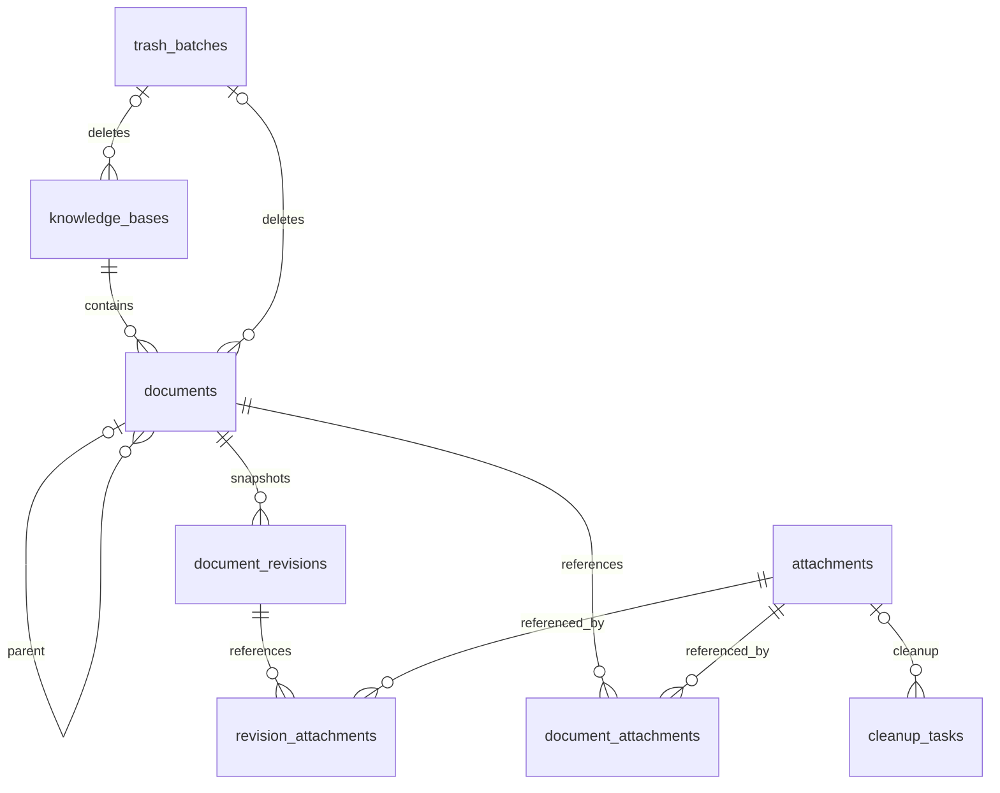

# 数据模型与接口设计

- 文档版本：v1.0
- 编写日期：2026-10-04
- 状态：待实施设计；本文不是已实现接口或数据库的说明。
- 技术前提：Vue 3 / TypeScript、Go、SQLite、Vditor；默认监听 `127.0.0.1:8080`，单机模式免登录。
- 阅读对象：后端、前端与测试开发人员。

## 1. 数据设计原则

1. Markdown 是文档正文唯一权威来源；HTML、检索纯文本和全文索引都可重新生成。
2. 知识库、文档、附件、历史记录、删除批次与任务均使用 UUID 作为对外标识。
3. 文档另有内部整数 `row_id`，用于 FTS5，不暴露为 API 文档 ID。
4. 文档内容采用整数 `revision` 乐观锁；成功保存递增，不以时间戳判断冲突。
5. 文档树调整、内容保存、软删除和恢复由数据库事务保证一致性。
6. 数据库事务不能覆盖文件系统操作；文件先暂存，删除通过可重试任务协调。
7. 删除默认进入回收站，附件不能按上传文档的归属直接删除。
8. 应用负责同库父节点、最大深度与循环检查，数据库负责基本外键完整性。

所有时间字段采用 UTC 的 Unix 毫秒整数；客户端按用户本地时区展示。标题允许同名但不能为空，初始上限为 200 个 Unicode 字符；正文初始上限 10 MiB。标识由后端生成并规范化；文件、导入包、查询与分页的初始可调限额统一见 [02-技术架构与运行部署第 9 节](02-技术架构与运行部署.md#9-附件与文件一致性)。

## 2. 实体关系与字段约定



| 表 / 视图 | 作用 | 关键约束 |
|---|---|---|
| `knowledge_bases` | 知识库及软删除状态 | UUID 主键，名称非空 |
| `documents` | 当前标题、Markdown、树位置 | UUID 唯一，整数 rowid，revision 大于等于 1 |
| `document_revisions` | 可恢复的正文历史 | 文档 UUID + 快照 revision 唯一 |
| `attachments` | 独立附件元信息与存储状态 | 路径唯一，状态受限 |
| `document_attachments` | 当前正文引用 | 文档 + 附件联合主键 |
| `revision_attachments` | 历史快照引用 | 历史记录 + 附件联合主键 |
| `trash_batches` | 删除与恢复操作的边界 | 区分文档子树和整个知识库 |
| `cleanup_tasks` | 可重试的文件清理队列 | 附件 ID，状态及重试时间 |
| `schema_migrations` | 已完成数据库升级 | 版本号主键与校验值 |
| `settings` | 全局持久化设置 | key 唯一，值使用 JSON |
| `operation_jobs` | 导入、导出、备份等任务 | 状态、结果路径、错误摘要；恢复进度另存外部状态 |
| `idempotency_records` | 重试请求去重 | 作用域 + 幂等键唯一 |
| `documents_search_content` | 仅含有效文档的检索内容视图 | row_id 对应 documents.row_id |
| `documents_fts` | FTS5 外部内容索引 | 内容来自上述视图，不存权威正文 |

`knowledge_base_id` 与 `parent_id` 使用对外 UUID；它们不引用 `row_id`。软删除不触发外键级联。实体物理清除时必须按引用依赖显式处理，禁止为便利而对正文、历史或附件设置无条件 `ON DELETE CASCADE`。

## 3. 核心数据库结构

以下 SQL 展示首版关键约束。实际迁移应按依赖顺序拆分，并通过目标 Go SQLite 驱动验证；所有连接均启用外键。

```sql
PRAGMA foreign_keys = ON;
PRAGMA journal_mode = WAL;
PRAGMA busy_timeout = 5000;

CREATE TABLE trash_batches (
  id TEXT PRIMARY KEY,
  kind TEXT NOT NULL CHECK (kind IN ('document_subtree','knowledge_base')),
  root_document_id TEXT,
  knowledge_base_id TEXT NOT NULL,
  created_at INTEGER NOT NULL,
  restored_at INTEGER,
  purged_at INTEGER
);
CREATE TABLE knowledge_bases (
  id TEXT PRIMARY KEY,
  name TEXT NOT NULL CHECK (length(trim(name)) > 0),
  description TEXT NOT NULL DEFAULT '',
  sort_order INTEGER NOT NULL DEFAULT 0,
  tree_revision INTEGER NOT NULL DEFAULT 1,
  created_at INTEGER NOT NULL,
  updated_at INTEGER NOT NULL,
  deleted_at INTEGER,
  delete_batch_id TEXT REFERENCES trash_batches(id) ON DELETE RESTRICT
);
CREATE TABLE documents (
  row_id INTEGER PRIMARY KEY AUTOINCREMENT,
  id TEXT NOT NULL UNIQUE,
  knowledge_base_id TEXT NOT NULL REFERENCES knowledge_bases(id) ON DELETE RESTRICT,
  parent_id TEXT REFERENCES documents(id) ON DELETE RESTRICT,
  title TEXT NOT NULL CHECK (length(trim(title)) > 0),
  markdown TEXT NOT NULL DEFAULT '',
  html TEXT NOT NULL DEFAULT '',
  search_text TEXT NOT NULL DEFAULT '',
  render_version TEXT NOT NULL DEFAULT '',
  sort_order INTEGER NOT NULL DEFAULT 0,
  revision INTEGER NOT NULL DEFAULT 1 CHECK (revision >= 1),
  created_at INTEGER NOT NULL,
  updated_at INTEGER NOT NULL,
  deleted_at INTEGER,
  delete_batch_id TEXT REFERENCES trash_batches(id) ON DELETE RESTRICT,
  CHECK (parent_id IS NULL OR parent_id <> id),
  CHECK ((deleted_at IS NULL) = (delete_batch_id IS NULL))
);
CREATE INDEX documents_tree_idx
  ON documents(knowledge_base_id, parent_id, deleted_at, sort_order);
CREATE INDEX documents_batch_idx ON documents(delete_batch_id);
CREATE TABLE document_revisions (
  id TEXT PRIMARY KEY,
  document_id TEXT NOT NULL REFERENCES documents(id) ON DELETE RESTRICT,
  revision INTEGER NOT NULL,
  title TEXT NOT NULL,
  markdown TEXT NOT NULL,
  reason TEXT NOT NULL CHECK (reason IN ('automatic','manual','before_restore')),
  created_at INTEGER NOT NULL,
  UNIQUE(document_id, revision)
);
CREATE INDEX revisions_document_time_idx
  ON document_revisions(document_id, created_at DESC);
CREATE TABLE attachments (
  id TEXT PRIMARY KEY,
  original_name TEXT NOT NULL,
  storage_path TEXT NOT NULL UNIQUE,
  media_type TEXT NOT NULL,
  size_bytes INTEGER NOT NULL CHECK (size_bytes >= 0),
  sha256 TEXT NOT NULL,
  state TEXT NOT NULL CHECK (state IN ('pending','ready','pending_delete','deleted','missing')),
  created_at INTEGER NOT NULL,
  updated_at INTEGER NOT NULL
);
CREATE TABLE document_attachments (
  document_id TEXT NOT NULL REFERENCES documents(id) ON DELETE RESTRICT,
  attachment_id TEXT NOT NULL REFERENCES attachments(id) ON DELETE RESTRICT,
  PRIMARY KEY(document_id, attachment_id)
);
CREATE TABLE revision_attachments (
  revision_id TEXT NOT NULL REFERENCES document_revisions(id) ON DELETE RESTRICT,
  attachment_id TEXT NOT NULL REFERENCES attachments(id) ON DELETE RESTRICT,
  PRIMARY KEY(revision_id, attachment_id)
);
CREATE INDEX document_attachments_attachment_idx ON document_attachments(attachment_id);
CREATE INDEX revision_attachments_attachment_idx ON revision_attachments(attachment_id);
```

`trash_batches` 的目标 ID 为审计元信息，不设置指回文档 / 知识库的循环外键，以便永久删除实体后仍显示批次记录。删除批次保留策略应与审计需求一起决定。

```sql
CREATE TABLE cleanup_tasks (
  id TEXT PRIMARY KEY,
  attachment_id TEXT NOT NULL REFERENCES attachments(id) ON DELETE RESTRICT,
  state TEXT NOT NULL CHECK (state IN ('queued','running','done','failed','cancelled')),
  attempts INTEGER NOT NULL DEFAULT 0,
  next_attempt_at INTEGER,
  last_error TEXT,
  created_at INTEGER NOT NULL,
  updated_at INTEGER NOT NULL
);
CREATE UNIQUE INDEX cleanup_one_active_task_idx ON cleanup_tasks(attachment_id)
  WHERE state IN ('queued','running','failed');
CREATE TABLE schema_migrations (
  version INTEGER PRIMARY KEY,
  checksum TEXT NOT NULL,
  applied_at INTEGER NOT NULL
);
CREATE TABLE settings (
  key TEXT PRIMARY KEY,
  value_json TEXT NOT NULL CHECK (json_valid(value_json)),
  updated_at INTEGER NOT NULL
);
CREATE TABLE operation_jobs (
  id TEXT PRIMARY KEY,
  kind TEXT NOT NULL CHECK (kind IN ('import','export','backup','restore')),
  state TEXT NOT NULL CHECK (state IN ('queued','running','succeeded','failed','cancelled')),
  progress INTEGER NOT NULL DEFAULT 0 CHECK (progress BETWEEN 0 AND 100),
  result_path TEXT,
  error_code TEXT,
  error_summary TEXT,
  created_at INTEGER NOT NULL,
  updated_at INTEGER NOT NULL
);
CREATE TABLE idempotency_records (
  scope TEXT NOT NULL,
  idempotency_key TEXT NOT NULL,
  request_hash TEXT NOT NULL,
  job_id TEXT REFERENCES operation_jobs(id) ON DELETE RESTRICT,
  response_json TEXT,
  created_at INTEGER NOT NULL,
  PRIMARY KEY(scope, idempotency_key)
);
```

SQL 的 JSON 函数可用性应列入驱动 PoC；若驱动缺少 JSON 能力，则保留文本字段并在 Go 层严格校验。数据库结构版本与应用版本分开；升级前执行可靠备份，迁移失败不启动写服务，也不尝试用旧二进制写入新 schema。

`settings` 保存数据集合标识 instance_id 及运行世代 data_epoch，两者都是 UUID。instance_id 随完整备份保留；data_epoch 在首次初始化及每次完整恢复后重新生成，不能直接沿用备份中的旧值。恢复任务的当前进度、恢复前备份位置、切换阶段与回退记录保存在被替换库之外的 `runtime/restore-state.json`，采用临时文件写入后 rename 的方式更新；表内记录只能作为结果镜像。

## 4. 保存、历史与树操作事务

### 4.1 内容保存的乐观锁

请求必须包含 `title`、`markdown` 和 `expected_revision`；可选 `snapshot` 为布尔值，默认 false，true 表示本次写入前强制保存当前版本快照。前端每篇文档仅允许一个保存请求在途；3 秒防抖与 30 秒最长间隔触发保存，IndexedDB 草稿独立于服务端保存。草稿主键包含 `instance_id + document_id + editor_session_id`，每个标签页拥有独立 editor_session_id，避免两个编辑页互相覆盖草稿；草稿还记录 base_revision、base_data_epoch 与本地编辑序号。instance_id 由 health 接口返回；同一 localhost 端口切换数据目录后不得把旧目录草稿自动套用到新目录。服务端绝不接收客户端提供的 HTML、索引正文或附件引用列表作为权威数据。

保存步骤如下：

1. 校验正文尺寸，解析 Markdown，生成过滤后的 HTML、检索文本与附件 UUID 集合。检索文本保留普通文字、代码块、公式 / Mermaid 源表达式、链接文字及目标 URL；不以渲染后的可见文字代替全部可搜内容，本地附件存储 ID 可排除。
2. `BEGIN IMMEDIATE` 后读取有效文档，检查所属知识库仍有效、X-Data-Epoch 等于当前世代及 revision 相等。
3. 按历史策略保存变更前快照及其附件引用；快照所指 revision 是旧版本。
4. 验证新引用的附件均可用，替换当前引用表，条件更新正文与 revision。
5. 触发器更新 FTS5；同步知识库更新时间，标题变化时递增 tree_revision，随后提交事务。
6. 返回新 revision 和保存时间；仅成功响应后才能标记客户端草稿已同步。

```sql
UPDATE documents
SET title = :title, markdown = :markdown, html = :html,
    search_text = :search_text, render_version = :render_version,
    revision = revision + 1, updated_at = :now
WHERE id = :id AND revision = :expected_revision AND deleted_at IS NULL;
-- 必须检查 affected_rows = 1；否则整个保存事务回滚。
```

标题的树内重命名也使用同一个内容保存协议，先读取正文和 revision，再提交标题变化，避免独立 rename 接口绕开冲突控制。重复提交同 revision 不应再次写入；如果客户端未收到响应，先 GET 比较当前内容与本地草稿，不能盲目覆盖。

`409 REVISION_CONFLICT` 返回服务端 revision、标题、更新时间和正文摘要；完整正文通过 GET 获取。客户端展示“保留本地草稿 / 查看服务端内容 / 人工合并”的入口，禁止自动把 expected_revision 改成最新值后覆盖。缓存重新生成不增加内容 revision，也不创建历史，但写回必须带读取时的 revision 条件； affected_rows 为 0 时丢弃旧缓存任务，避免覆盖随后保存的新缓存。

```sql
UPDATE documents SET html=:html, search_text=:search_text, render_version=:render_version
WHERE id=:id AND revision=:source_revision AND deleted_at IS NULL;
```

### 4.2 历史保留规则

- 默认每篇保留最多 100 条快照，数量可配置；revision 每次保存递增，历史并不覆盖每一个 revision。
- 自动保存以 5 分钟窗口控制数量：窗口首次内容变更保存旧内容，随后保存不新增自动快照。
- 手动保存通过 `PUT /documents/{id}` 的 `snapshot:true` 请求显式快照；恢复任一历史前强制保存当前正文，再写入历史正文作为新 revision。
- 相同文档与 revision 已有快照时复用该记录，不因 reason 不同创建重复快照。
- 达到数量上限后，在保存事务中清理最旧记录及其 `revision_attachments`；恢复前快照至少保留到本次操作完成。
- 历史保留数量减少、永久删除正文或附件清理，都应提示相关恢复能力会减少。

### 4.3 树调整与排序

树接口一次读取知识库节点元数据并在内存组树，不返回全部 Markdown。采用稳定排序 `sort_order ASC, id ASC`。节点根深度为 1，最多 32 层；移动整个子树时计算目标深度加子树高度。

首版支持创建根文档 / 子文档、删除及恢复，新文档追加到同级末尾；同库移动、手动重排和拖拽列入 P1，首版不注册 position 接口。所有创建、导入、删除、恢复、标题重命名及 P1 结构调整都在事务内递增 tree_revision，并以当前树版本验证结构写入。

P1 移动请求提交 `parent_id`、`before_id` 和 `expected_tree_revision`；`parent_id=null` 表示根，`before_id=null` 表示同级末尾。后端验证目标父节点有效、属于同库、不是自身或后代；before_id 必须是目标父节点下的有效同级节点且不是被移动节点。

P1 在一个 `BEGIN IMMEDIATE` 事务内读取树版本、验证结构、移除节点、插入目标位置，重新赋连续整数 sort_order，必要时同时重排原父节点下的节点，最后递增知识库 tree_revision。初次实现移动时重排同级列表即可，不必提前实现稀疏序号算法。过期树版本返回 409，客户端刷新树后重新操作。

```sql
WITH RECURSIVE subtree(id, depth) AS (
  SELECT id, 1 FROM documents WHERE id = :root AND deleted_at IS NULL
  UNION ALL
  SELECT d.id, s.depth + 1 FROM documents d JOIN subtree s ON d.parent_id = s.id
  WHERE d.deleted_at IS NULL AND s.depth < 33
)
SELECT id, depth FROM subtree;
```

上述查询用于验证已正常的树；启动只做轻量数据库 / schema 检查，树全量完整性检查作为维护操作，或在发现异常时执行。树操作发现环、深度异常或缺失父节点时应安全停止该操作并进入修复流程，不能依赖有深度截断的递归查询证明没有环。跨知识库移动列为后续能力，P1 的同库移动接口若收到跨库目标，返回 `CROSS_LIBRARY_MOVE_UNSUPPORTED`。

## 5. 回收站与附件引用

### 5.1 删除批次

删除子树先创建批次，再将本次有效根与有效后代统一标记 `deleted_at` 和 `delete_batch_id`。已在回收站的后代不更换原批次，防止一次恢复混入更早删除的数据。删除知识库同理，仅收集当前有效文档；已删除子树仍属于原批次。

删除后正文、当前附件引用、历史和历史引用保留。常规详情、树、搜索排除软删除内容，回收站接口单独读取。默认不自动清空；永久删除需明确确认整个批次，数据库先清理引用和实体，再生成可人工确认的附件清理候选。

恢复子树以完整批次为单位，保留批次内部父子关系。原外部父节点不可用时，批次根恢复到原知识库根级，响应列出调整原因；原知识库已删除时先恢复知识库批次，若知识库已永久删除则该状态不应发生，因为外键会阻止不完整清除。恢复与重新排序、树版本递增同事务完成。

永久删除知识库应清除其所有有效 / 已删除文档及历史，包含此前独立删除的子树，并在确认信息中列出数量。物理删除按叶到根执行，先移除当前和历史引用；不得仅按最后一次知识库删除批次挑选文档。

### 5.2 附件存储与引用

- 路径统一为 `uploads/<ID前两位>/<附件ID>/blob`，其中前缀取附件 UUID 的前两位；不依赖原文件扩展名，原文件名仅用于展示和下载。
- 正文使用根相对地址 `/api/v1/attachments/{id}/content`，避免写入主机名、端口和知识库 / 文档路径。
- 内部文档链接为 `/documents/{document_uuid}`，标题和父节点变化不改变链接；删除后阅读页显示状态。
- 引用解析处理图片、链接、引用式链接和允许的 HTML 属性；通过 AST 及 URL 规范化识别本地 ID，不能只匹配一段正则。
- 当前引用、回收站正文引用、历史引用全部阻止物理删除；外部图片 URL 不记为本地附件。
- 上传成功尚未写入正文的附件保留为未绑定资源；首版不自动删除，管理页列出候选供用户确认。曾被引用但后来失去所有引用的附件也采用人工确认，避免尚未同步的浏览器草稿仍依赖该文件。

上传流程是“限额校验 → 临时文件 → 校验 hash / 类型 → pending 元数据 → 原子 rename 到 uploads → ready 状态”。失败时记录可恢复状态；启动时检查 pending、临时文件、缺失文件，禁止把未写完文件标记 ready。

人工确认清理后，在同一写事务中再次检查两张引用表，把无引用附件置为 pending_delete 并插入 cleanup_tasks。保存 / 恢复只接受 ready 附件，pending_delete 拒绝新引用和新下载；队列工作者领取任务后再次检查引用和状态，等待已开始的文件读取结束再删除文件，成功后把元信息置 deleted。删除过程中由统一文件读写协调机制避免下载与删除竞态；重试发现文件已不存在可视为成功，不能反复报错。

引用检查、队列领取和物理删除之间不能凭借普通数据库事务假设原子性。工作者完成后更新数据库失败时，下次重试仍能依据文件不存在完成；遇到意外引用则取消任务并报警修复，不能带引用继续删。附件 SHA-256 首版用于校验，不自动做内容去重。

## 6. 全文检索

### 6.1 FTS5 外部内容与触发器

首版先使用 FTS5 `unicode61` 检索英文及可识别词项，中文短词提供参数化 LIKE 兜底；中文分词接入方式和最终索引策略在 PoC 后决定，不在本设计中承诺现成的完整中文分词。不得同时使用触发器和应用代码手工维护 FTS。

```sql
CREATE VIEW documents_search_content AS
SELECT row_id, title, search_text FROM documents WHERE deleted_at IS NULL;
CREATE VIRTUAL TABLE documents_fts USING fts5(
  title, search_text,
  content='documents_search_content', content_rowid='row_id',
  tokenize='unicode61'
);
CREATE TRIGGER documents_fts_ai AFTER INSERT ON documents
WHEN new.deleted_at IS NULL BEGIN
  INSERT INTO documents_fts(rowid,title,search_text)
  VALUES(new.row_id,new.title,new.search_text);
END;
CREATE TRIGGER documents_fts_ad AFTER DELETE ON documents
WHEN old.deleted_at IS NULL BEGIN
  INSERT INTO documents_fts(documents_fts,rowid,title,search_text)
  VALUES('delete',old.row_id,old.title,old.search_text);
END;
CREATE TRIGGER documents_fts_au
AFTER UPDATE OF title,search_text,deleted_at ON documents BEGIN
  INSERT INTO documents_fts(documents_fts,rowid,title,search_text)
  SELECT 'delete',old.row_id,old.title,old.search_text WHERE old.deleted_at IS NULL;
  INSERT INTO documents_fts(rowid,title,search_text)
  SELECT new.row_id,new.title,new.search_text WHERE new.deleted_at IS NULL;
END;
-- 初次建索引、修复或升级分词配置后重建；外部视图只含未删除文档。
INSERT INTO documents_fts(documents_fts) VALUES('rebuild');
```

不把无关树移动、访问时间或缓存 HTML 更新纳入 FTS 触发列。重建与恢复测试必须使用真实驱动，验证软删除、恢复和历史恢复后的索引内容一致。

### 6.2 查询与结果规则

```sql
SELECT d.id, d.knowledge_base_id, d.title,
       bm25(documents_fts, 5.0, 1.0) AS score
FROM documents_fts JOIN documents d ON d.row_id = documents_fts.rowid
JOIN knowledge_bases k ON k.id = d.knowledge_base_id
WHERE documents_fts MATCH :normalized_query
  AND d.deleted_at IS NULL AND k.deleted_at IS NULL
ORDER BY score ASC, d.updated_at DESC, d.id ASC
LIMIT :limit OFFSET :offset;
```

普通搜索框把输入转换为字面词项，正确处理引号和 FTS 语法；SQL 参数化本身不能消除 MATCH 语法错误。首版不默认开放 FTS 运算符。中文兜底转义 `%`、`_` 和转义符，再使用 `LIKE :pattern ESCAPE '\'`；避免每次查询无条件全库扫描，按查询语言和未命中情况启用，设置超时与输入长度限制。

FTS 和 LIKE 的分数不能直接比较；两条路径合并按文档 UUID 去重，定义标题精确 / 标题包含优先，然后保留 FTS 相关性排序。响应包含 `search_mode`，便于测试判定实际使用策略。分页初始最大 100 条，可通过资源限额设置调整；大库性能未验证前不承诺固定响应时间。

搜索片段返回纯文本和 `[start,end)` 高亮区间，索引以 Unicode 码点计数，前端先转换码点数组再标记，防止直接注入 HTML。点击结果打开正文并在阅读视图查找关键词；任意正文命中不使用标题锚点冒充准确定位。

## 7. HTTP API 通用约定

- 前缀统一为 `/api/v1`，JSON 使用 snake_case，UTF-8；ID 使用 UUID 字符串。
- 成功响应 `{ "data": ..., "meta": ... }`；错误响应 `{ "error": { "code": "...", "message": "...", "details": {} }, "request_id": "..." }`。
- 分页使用 `page`（从 1 开始）、`page_size`（默认 20、初始最大 100，可调），meta 返回 `total`；任务与树规模需设置请求上限。
- GET 列表默认不含回收站；空字符串 ID 无效，根节点 parent_id 必须显式为 null。
- POST 创建返回 201，异步任务返回 202，普通更新返回 200；软删除返回 200 和批次信息，成功且无结果正文的永久删除可返回 204。
- 文件响应设置正确 Content-Type、Content-Disposition、nosniff；主动内容如 HTML、SVG 使用 `application/octet-stream` 和 `Content-Disposition: attachment` 强制下载。仅允许确认安全的图片类型内联展示，附件路由不得绕过未来认证。
- `Idempotency-Key` 用于导入、导出、备份等任务及新建请求；相同键不同请求 hash 返回 409。
- 所有写入请求必须携带 `X-Data-Epoch`，值来自 health.data_epoch。完整恢复可能让 revision 回到旧值，世代检查必须先于 revision 检查并在提交写入前再次确认；过期 / 缺失世代返回 `409 DATA_EPOCH_CHANGED`。客户端保留草稿并要求重新加载、比较数据，不能自动替换为新 epoch 重发旧内容。任务内部写入同样绑定创建时世代，恢复前等待或取消旧世代任务。
- 默认本机免登录；局域网会话、HTTPS 配置与跨库移动属于后续实现，接口须保留统一中间件入口。

### 7.1 知识库、树与文档

| 方法 | 路径 | 请求 / 行为 |
|---|---|---|
| GET | `/knowledge-bases` | 分页列表，返回文档数量与更新时间 |
| POST | `/knowledge-bases` | `{name,description}`，创建知识库 |
| GET / PUT | `/knowledge-bases/{id}` | 详情 / `{name,description}` 修改 |
| DELETE | `/knowledge-bases/{id}` | `{expected_tree_revision}`，软删除有效内容，返回批次信息 |
| GET | `/knowledge-bases/{id}/tree` | 节点元数据、tree_revision；不含正文 |
| POST | `/knowledge-bases/{id}/documents` | `{parent_id,title,markdown,expected_tree_revision}`，同级末尾创建 |
| PUT（P1） | `/documents/{id}/position` | `{parent_id,before_id,expected_tree_revision}`，首版不暴露 |
| GET | `/documents/{id}` | 标题、markdown、html、render_version、revision |
| PUT | `/documents/{id}` | `{title,markdown,expected_revision,snapshot?}`，snapshot 默认 false |
| DELETE | `/documents/{id}` | `{expected_tree_revision}`，软删除子树，返回批次与数量 |
| GET | `/documents/{id}/history` | 分页历史摘要；正文由详情单独获取 |
| GET | `/documents/{id}/history/{history_id}` | 快照标题、正文、revision |
| POST | `/documents/{id}/history/{history_id}/restore` | `{expected_revision}`，恢复为新版本 |

显式快照保存的 JSON 示例：`{"title":"项目笔记","markdown":"正文","expected_revision":12,"snapshot":true}`。历史恢复的 JSON 示例：`{"expected_revision":13}`，请求同时携带当前 `X-Data-Epoch`；expected_revision 不可省略，恢复目标快照必须属于 URL 中的文档。

### 7.2 回收站、附件与搜索

| 方法 | 路径 | 请求 / 行为 |
|---|---|---|
| GET | `/trash` | 分页批次列表，可按知识库筛选 |
| GET | `/trash/{batch_id}` | 批次节点与影响范围 |
| POST | `/trash/{batch_id}/restore` | `{expected_tree_revision}`，整批恢复，返回父节点调整列表 |
| DELETE | `/trash/{batch_id}` | `{confirmation_token}`，永久删除批次内容 |
| POST | `/attachments` | multipart 文件上传，返回 id、url、状态 |
| GET | `/attachments` | 分页元信息，可筛选 unreferenced / missing |
| GET | `/attachments/{id}` | 元信息、当前 / 历史 / 回收站引用数量 |
| GET | `/attachments/{id}/content` | 图片读取或附件下载，支持 HEAD |
| POST | `/attachments/cleanup-preview` | `{attachment_ids}`，生成短期确认令牌及引用校验结果 |
| POST | `/attachments/cleanup` | `{attachment_ids,confirmation_token}`，加入可重试清理队列 |
| GET | `/search` | `q,knowledge_base_id?,page,page_size`，返回片段和高亮区间 |

永久删除的 confirmation_token 由对应批次详情中的删除预览生成，绑定批次内容摘要与短期有效时间；内容变化时重新预览。它用于防止过期确认误删，不是访问认证，也不要求重复输入密码。

### 7.3 数据流转、设置与健康

| 方法 | 路径 | 请求 / 行为 |
|---|---|---|
| POST | `/imports/preflight` | 上传 Markdown / ZIP，预检后返回 preview_id、目录和警告 |
| POST | `/imports` | `{preview_id,target_knowledge_base_id,target_parent_id,expected_tree_revision}`，整批新增；target_parent_id 可为 null |
| POST | `/exports` | `{scope,id,format,include_attachments}`，启动导出 |
| POST | `/backups` | 创建完整备份任务，协调数据库与附件一致性 |
| GET | `/backups` | 分页备份元信息，文件路径不直接暴露到浏览器 |
| POST | `/backups/validate` | 上传 / 选择备份并校验 manifest、hash、schema 兼容性 |
| POST | `/backups/restore` | `{validated_backup_id,confirmation_token}`，进入维护恢复流程 |
| GET | `/jobs/{id}` | 任务状态、进度、结果地址；恢复任务优先读取外部状态 |
| GET | `/jobs/{id}/download` | 下载导出或备份结果，校验任务可用与文件存在 |
| GET / PUT | `/settings` | 设置读取 / 白名单字段更新，返回是否需重启 |
| GET | `/health` | instance_id、data_epoch、版本、数据库状态、可写及维护状态 |

restore 会替换整个数据集，应由维护模式阻止编辑、等待在途写入、生成恢复前备份并检查所有文件，再分阶段切换数据库与附件等数据。承载数据目录及其文件锁不参与整体重命名。恢复前将任务身份、幂等键和回退记录持久化到 `runtime/restore-state.json`，不能只写 operation_jobs / idempotency_records，因为这两张表本身会被替换。任务轮询和重复恢复请求由外部恢复协调器处理；成功后重开数据库、重新生成并持久化 data_epoch，再开放写服务，浏览器重新加载而非自动重启应用进程。HTTP 202 只代表任务已受理，客户端必须轮询 job，不能把任务创建当作恢复完成；崩溃重启也需从外部状态决定继续 / 回退。

## 8. 导入、导出与幂等

导入预检阶段只写隔离暂存区，不写正式文档：校验文件大小、解压后总量、条目数量、压缩比、编码、目录深度和资源引用；拒绝绝对路径、`..` 穿越、符号链接、重复规范化路径。资源路径允许跨文档引用，但不能越出包根目录。

预览明确标题映射、父子关系、同名提示和缺失资源。首版普通导入只新增，统一分配新 UUID，同名标题允许，不提供覆盖、替换或跳过策略。缺失本地资源属于预检错误，整包拒绝；外部 URL 保留并提示网络依赖。含系统导出 manifest 时据此重建内部链接映射，但仍生成新 UUID；只有完整备份恢复保留原 UUID。

提交时校验预览未过期和目标仍有效，资源先复制到正式待激活路径，随后在单事务中新增文档、引用、树排序、任务结果和幂等记录；事务失败的文件列入候选清理。任务重新执行先检查幂等记录及已持久化任务阶段，不重复创建树；相同文件使用不同幂等键代表用户主动再次导入。

单篇 / 整库导出保留标题，节点既有正文又有子节点采用 `目录/index.md`。文件名清洗后处理冲突、系统保留名称和长度；manifest 保存文档 UUID 与导出路径映射，内部链接、图片和附件改为包内相对路径。纯 Markdown 导出若不带附件，界面明确列出资源缺失影响。

导出用于阅读和迁移，默认包含有效文档及其资源；完整备份包含数据库、附件、历史、回收站、设置与校验清单。在线备份使用 SQLite Backup API 等一致性机制，并冻结 / 协调附件变化；不得把运行中依次复制 db、wal、uploads 视为一致备份。

### 8.1 内容包格式

首版内容 ZIP 使用 `manifest.json`、`documents/`、`assets/` 三个区域。Markdown 文件保存原始正文，独立标题在 manifest 中，不人为增加正文 H1；父文档有子节点时按实际路径映射生成目录与 index.md。下面是字段示意，UUID 和哈希在实际文件中必须完整有效。

```json
{
  "format": "ljmdb-content",
  "format_version": 1,
  "created_at": "2026-10-04T12:00:00Z",
  "knowledge_base": {"name": "学习笔记", "description": "个人资料"},
  "documents": [
    {
      "source_id": "<document-uuid>",
      "title": "Go 笔记",
      "parent_source_id": null,
      "sort_order": 0,
      "path": "documents/go-<id>/index.md"
    }
  ],
  "attachments": [
    {
      "source_id": "<attachment-uuid>",
      "original_name": "示意图.png",
      "media_type": "image/png",
      "path": "assets/<id>.png",
      "size_bytes": 12345,
      "sha256": "<64-hex-characters>"
    }
  ],
  "unresolved_links": []
}
```

导入通过 source_id 到新 UUID 的映射恢复 parent_source_id、排序、内部链接和附件。manifest 不能指定本机存储路径或授权覆盖对象；版本不支持、重复 ID、父关系成环、文件缺失或哈希不匹配均拒绝预检。普通 ZIP 无 manifest 时按目录解释；`index.md` 代表该目录节点的正文，只有子节点的目录生成空正文父节点，以保留层级。

包内链接重写为导出路径；指向本次范围之外的文档不自动扩大导出范围，保留原稳定 ID 引用并列入 unresolved_links，界面提示这些链接离线不能跳转。外部网络图片也列入依赖报告，不冒充已携带本地资源。

路径清洗应处理非法字符、Windows 保留名、大小写不敏感碰撞与累计路径长度。过长树路径可退化为 `documents/<UUID>.md` 平铺，原树在 manifest 中保留；不能因长路径静默遗漏文档。任何路径转换通过唯一映射重写链接，禁止相同归档路径覆盖。

纯 `.md` 文本导出在原正文前增加独立标题 H1，不删除正文自己的 H1；它用于阅读交换，不承诺元数据无损回导。需要保真重新导入时使用带 manifest 的 ZIP。HTML 包另含本地样式、脚本或预渲染内容，仍采用同一文档与资源映射。

### 8.2 完整备份格式

完整备份采用独立的 `format="ljmdb-backup"` 与 format_version，包含数据库快照、uploads 内容和 manifest。manifest 至少记录应用版本、schema 版本、instance_id、创建时间、数据库哈希、附件列表及哈希；机器路径、运行锁、日志和临时文件不作为恢复数据导入。

验证时拒绝危险归档路径、缺失或意外文件、哈希不一致及不支持的较新 schema。数据库较旧时通过已验证迁移后才能开放写服务。完整恢复保留正文 ID、历史和回收站，重新生成 data_epoch；普通内容包不能进入完整恢复接口，备份包也不能按内容导入规则重建为新文档。

## 9. 错误码与验证要求

| HTTP | code | 处理约定 |
|---|---|---|
| 400 | `INVALID_ARGUMENT` / `INVALID_SEARCH_QUERY` | 提示具体字段，不创建部分数据 |
| 404 | `NOT_FOUND` | 正常接口不暴露已删除正文 |
| 409 | `REVISION_CONFLICT` / `TREE_REVISION_CONFLICT` | 保留本地编辑，重新获取当前状态 |
| 409 | `DATA_EPOCH_CHANGED` | 保留草稿，重新加载并人工比较，禁止自动重发旧内容 |
| 409 | `INVALID_TREE_MOVE` / `ATTACHMENT_IN_USE` | 返回结构原因 / 引用摘要 |
| 409 | `IDEMPOTENCY_KEY_REUSED` / `BACKUP_INCOMPATIBLE` | 不继续重试同一错误参数 |
| 413 | `PAYLOAD_TOO_LARGE` / `ARCHIVE_LIMIT_EXCEEDED` | 返回生效限额 |
| 415 | `UNSUPPORTED_FILE_TYPE` | 文件不进入正式目录 |
| 422 | `IMPORT_PREFLIGHT_FAILED` / `CROSS_LIBRARY_MOVE_UNSUPPORTED` | 预览或功能范围不满足 |
| 503 | `DATABASE_BUSY` / `MAINTENANCE_MODE` | 有界退避重试，草稿仍保留 |
| 507 | `INSUFFICIENT_STORAGE` | 停止本次操作并显示未保存状态 |
| 500 | `INTERNAL_ERROR` | 返回 request_id，日志保留细节而响应不泄漏本机路径 |

数据库错误需分类，SQLite busy / 磁盘空间不足不可全部映射为普通 500。所有对外错误描述为中文可读文本，code 作为稳定机器协议，日志不得记录原始密码或整篇私密正文。

首版验收至少覆盖：两标签页同 revision 保存只允许一方成功且草稿互不覆盖；创建 / 导入 / 恢复超过 32 层被拒绝；软删除、恢复、历史恢复后的索引一致；复制图片后删除原文档仍可阅读；历史引用阻止附件清理；清理中断可重试；导入重试不重复创建；恶意 ZIP 被预检拦截；备份恢复后正文、树、历史和资源校验通过，旧世代写入即使 revision 相同仍被拒绝，恢复任务能跨数据库替换继续轮询。P1 另验收树移动并发、循环与排序事务。上述验证通过后才能将本文状态更新为已实现设计。
