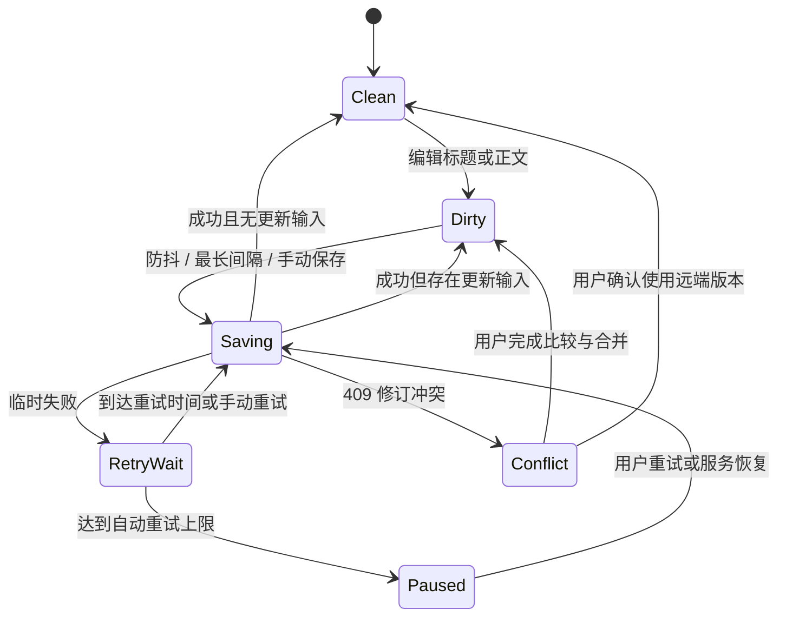

# 页面交互与异常处理

- 文档版本：v1.0。
- 编写日期：2026-10-04。
- 文档状态：待实施设计；本文描述验收目标，不表示对应功能已经实现。
- 适用范围：本地单人 Web 知识库首版，默认监听 `127.0.0.1`，无需登录。

## 1. 交互边界与基本原则

首版提供知识库、基本多级文档树、编辑与阅读、稳定 ID 内部链接、自动保存、附件、历史、回收站、搜索、导入导出、备份恢复和设置。
同库移动、手动重排与拖拽统一列入 P1；跨知识库移动、收藏、多编辑模式、标签、反向链接和局域网认证也列入后续版本，不在首版页面中展示无法使用的入口。
编辑器固定使用 Vditor 即时渲染模式 `ir`；阅读模式是独立的只读展示状态，不是第二种编辑器模式。
任何会离开当前编辑上下文的操作，都先检查未保存修改、上传任务和恢复中的草稿。
正文已写入浏览器草稿与已写入数据库必须分别说明，不能都显示为“已保存”。
错误信息应包含发生的操作、现有内容是否安全以及下一步可执行动作，避免只显示错误码。
界面中的时间按用户系统时区显示，备份名称、错误详情和技术信息保留可辨识的完整时间。

## 2. 页面职责与导航

| 页面或面板 | 主要职责 | 核心入口与退出行为 |
| --- | --- | --- |
| 知识库首页 | 展示名称、描述、有效文档数、最后更新时间 | 新建、打开、修改信息、移入回收站、全局搜索 |
| 文档工作区 | 知识库切换、文档树、阅读与编辑、保存状态 | 新建同级或子文档、重命名、内部链接、附件、历史 |
| 搜索面板 | 全局或库内检索、展示片段、跳转命中 | 保留查询和筛选条件，返回后继续浏览结果 |
| 历史面板 | 浏览版本、预览、恢复选定版本 | 退出不改变正文；恢复需生成新的当前修订 |
| 回收站 | 展示删除批次、范围、时间，执行恢复或永久删除 | 恢复整个删除批次，展示恢复结果 |
| 导入导出面板 | 预检、新增确认、执行、下载与错误报告 | 长任务显示进度和当前阶段 |
| 备份恢复面板 | 创建完整备份、校验归档、恢复及页面重载提示 | 与可读内容导出分开，明确覆盖范围 |
| 设置页 | 数据路径、端口只读信息、历史上限、显示偏好 | 启动参数提供修改指引，产品设置标明生效方式 |

首次打开进入知识库首页；后续可恢复上次访问的有效文档，但不绕过待恢复草稿提示。
文档地址统一为 `/documents/{id}`，其中 `id` 是稳定文档 ID；重命名或未来同库父节点变化不改变地址。
树节点只请求组织信息；点击文档后再加载正文，避免树加载携带整库内容。
当前文档、展开节点和阅读位置可以记忆，文档删除后应清除对应失效导航状态。
空知识库展示“新建第一篇文档”和“导入 Markdown”，不展示一个没有说明的空白编辑器。

## 3. 工作区布局与阅读编辑切换

左栏包含知识库切换器、文档树、搜索和回收站入口，中间为文档内容，右侧为可折叠大纲。
窄屏时左栏与大纲变为抽屉，保持正文优先，不挤压编辑器到无法操作。
顶部固定显示标题、阅读或编辑状态、保存状态、最近成功保存时间和文档操作菜单。
阅读模式展示标题、正文、大纲和有效链接；任务复选框只读，修改需进入编辑模式。
编辑模式只提供 `ir`，支持工具栏、源码语法输入、附件上传和手动保存。
从编辑切到阅读需完成当前保存，或按保存失败流程选择下一步；不能用旧服务端内容覆盖当前正文。
阅读模式中的公式、图表和代码高亮必须使用本地资源，失败时显示原始表达式或代码及重试入口。
长文档加载期间先显示标题与骨架，正文完成后再启用编辑，防止用户修改占位内容。
渲染失败不影响获取 Markdown；错误区域提供“编辑源码”和“导出 Markdown”入口。
大纲节点来自当前正文标题，重复标题生成不同锚点，点击后将焦点和滚动位置一起移动。

## 4. 知识库与文档树主流程

新建知识库只要求名称，描述选填；提交期间按钮禁用，失败保留输入内容。
新建文档先获得服务端 `doc_id` 和初始修订，再开启编辑与附件上传。
若创建失败，保留输入的标题并提供重试，不在树中留下看似创建成功的节点。
“新建同级文档”和“新建子文档”分别明确目标位置，默认插入目标层级末尾。
重命名提交成功后同步标题输入框、树和页面标题；失败时保留编辑值并标识尚未保存。
首版不提供“移动到”“上移”“下移”或拖拽，文档按创建位置和同级创建顺序展示。
P1 增加移动及重排时，应提供键盘可操作的菜单，移动前检查当前文档保存状态。
初始深度保护为最多 32 层；首版创建、导入与恢复以及 P1 移动均需执行相同规则。
P1 父节点候选中禁用自身及后代；后端校验无环、同库，并按最深后代计算移动后的深度。
达到深度上限时说明原因，提供创建同级文档或选择较浅父节点的操作。
P1 同级重排菜单可提供“上移”“下移”，已在边界的动作禁用。
P1 移动、重排失败后恢复服务端确认的位置，不把失败操作作为成功状态保留。
文档删除入口显示后代数量和删除范围，确认后按一个批次移入回收站。
删除当前打开文档后转到父文档或知识库空态，并提示可在回收站恢复。
存在未保存修改时先处理保存或草稿，不允许删除流程默默跳过当前编辑内容。

## 5. 自动保存状态机

自动保存采用输入停止 3 秒的防抖，同时设置持续编辑最长 30 秒触发一次保存。
标题和正文作为同一份编辑状态提交，树内重命名也纳入同一文档保存协调流程。
每篇文档只允许一个写请求在途；后续输入合并为下一份待发送状态。
请求绑定 `doc_id` 与请求快照，以草稿的 `base_revision` 填写接口 `expected_revision`；响应不得写入另一篇已切换文档。
保存成功只确认该请求携带的内容；若用户在请求期间继续输入，界面仍显示有新修改待保存。
后端成功响应返回新 `revision`；客户端随后基于该修订继续提交。
客户端仅在服务端确认当前最新编辑内容后显示“已保存”。

| 状态 | 用户看到的内容 | 可执行操作与保护 |
| --- | --- | --- |
| 已保存 | 最近成功保存时间 | 可以正常切换，浏览器草稿仅在最新内容确认后清理 |
| 有修改 | 等待自动保存、本地草稿状态 | 继续输入或手动保存，触发 3 秒与 30 秒计时 |
| 保存中 | 正在保存，可继续编辑 | 禁止重复创建并行写请求，新增输入进入下一轮 |
| 重试等待 | 保存失败原因、下一次重试倒计时 | 手动重试、导出草稿、继续编辑 |
| 暂停重试 | 尚未写入数据库，自动重试已暂停 | 手动重试或恢复服务后重试，不清除编辑内容 |
| 修订冲突 | 另一页面已保存更新 | 比较差异、合并、另存新文档或确认使用远端 |

临时失败采用有界指数退避，例如 2、4、8、16、30 秒，最多连续自动重试 5 次。
服务不可达、超时和短暂数据库繁忙可以重试；无效输入、磁盘不足等需处理原因后重试。
`409` 进入冲突流程，禁止自动强行覆盖；具体错误分类以后端稳定错误码为准。
手动保存使用 `Ctrl+S` 或 `Cmd+S`，拦截浏览器保存网页行为并提供可访问的状态提示。
首版不承诺关闭页面请求一定完成；`beforeunload` 只对未确认保存的修改提示离开风险。
卸载时发送请求仅作为尽力保存，不能据此清理草稿或显示服务端保存成功。

## 6. 本地草稿、切换失败与多标签页

IndexedDB 草稿以 `instance_id + document_id + editor_session_id` 为主键，至少记录基础 `data_epoch`、`base_revision`、`content`、`time`，同时保存标题和本地编辑序号。不同标签页使用独立会话 ID，不覆盖同一文档的其他草稿；恢复面板可列出多份待处理草稿。
打开文档前从健康检查接口读取数据实例 `instance_id`，以 `instance_id + doc_id` 划分草稿作用域。
同一端口切换到另一数据目录时，不自动恢复旧实例草稿；提供查看与导出入口，明确其所属实例。
草稿随编辑尽快更新，不等待 3 秒网络保存；写入失败须展示草稿保护不可用的持续提示。
显示“已保留本地草稿”必须以 IndexedDB 写入成功为前提，内存中存在内容不等于已持久化。
草稿属于当前浏览器和应用来源；端口、浏览器配置或数据站点变更后不保证能够读取原草稿。
切换知识库、文档、历史恢复或阅读状态前，先完成最新编辑快照的保存。
如果保存失败，弹窗提供“保持编辑”“保留本地草稿后切换”“导出草稿”三个动作。
只有确认本地草稿持久化成功才执行“保留本地草稿后切换”；失败则保持当前编辑。
恢复网络或服务后，后台不得直接提交用户尚未确认取舍的历史草稿。
重新打开文档发现草稿时，展示草稿时间、对应基础修订和服务端最近更新时间。
草稿与当前版本一致时可直接清理冗余草稿；不一致时展示恢复或比较提示。
基础修订仍匹配时，可选择“恢复草稿继续编辑”“导出草稿”或“放弃草稿”。
基础修订不匹配时，进入差异比较，保留两份内容；优先支持手动合并或另存为新文档。
“使用远端版本”及“放弃草稿”需明确告知将丢弃哪份本地内容，确认后才能删除草稿。
合并结果先写入本地草稿，再基于最新远端修订保存；再次冲突则重新比较。
多个标签页可通过浏览器通信提示“此文档也在另一页面编辑”，但最终一致性由后端修订校验保证。
保存响应丢失后重试若收到冲突，允许识别远端内容与请求快照一致的已成功保存情形。

## 7. 内部链接与附件交互

“插入文档链接”通过标题搜索目标，结果显示所属知识库和路径帮助区分同名文档。
链接保存稳定文档 ID，展示文本可编辑；重命名和后续同库移动不会让链接失效。
链接指向回收站文档时展示已删除提示和恢复入口，永久删除后展示不存在提示。
附件上传开始前校验允许类型与大小，上传中展示文件名、进度和取消动作。
上传成功后才把稳定附件 URL 插入当前文档；取消或失败不得插入不可访问的最终链接。
服务端使用 UUID 存储附件，界面保留原始文件名，重复文件名不覆盖已有附件。
上传响应必须绑定发起上传的文档，不得因切换编辑器而插入另一篇文档。
粘贴多张图片时逐项展示状态，部分失败可单独重试，不要求重传已成功项。
图片加载失败展示替代文本、文件名及重试入口；不让一个损坏附件阻塞正文阅读。
历史与回收站仍引用的附件需保留，删除正文中的链接不等于立即删除磁盘文件。
首版所有无服务端引用的附件均只列为候选项，由用户查看并确认后清理，不自动删除。
候选列表提醒：其他标签页、浏览器和本地草稿可能含尚未提交的引用，清理前应检查并保存相关草稿。
候选附件清理需再次校验当前、历史与回收站引用，已被引用的项跳过并说明原因。
附件进入 `pending_delete` 后拒绝新增引用；保存遇到该状态时保留草稿，提示重新上传或移除对应链接。

## 8. 历史与回收站

历史面板默认按新到旧列出，显示时间、修订及变更摘要，选中后只读预览。
默认每篇保留 100 条历史，可在设置调整；历史形成策略按有意义的保存批次，不按每次击键建立。
调整上限涉及清理已有历史时，展示受影响数量并在确认后执行，不静默大量删除。
恢复历史前保存或保护当前草稿，并明确将历史内容作为一个新的当前修订。
恢复成功后回到文档，显示恢复来源时间；旧当前版本按历史策略保留。
回收站以删除批次展示，包括删除的知识库或根文档、后代数量和删除时间。
首版默认不自动清空回收站，不设隐藏的到期删除任务。
恢复按整批子树执行，不提供可能破坏父子关系的零散子节点恢复。
原父节点有效且符合层级规则时恢复到原位置；原父节点已不存在或不可用时恢复到有效知识库根层并告知。
原知识库仍在回收站时，先提示恢复知识库；永久删除知识库会同时删除其下所有回收批次。
确认永久删除知识库时明确上述范围；已永久删除的内容无法通过回收站迁移到其他库恢复，只能考虑此前备份。
恢复后若会超出 32 层，阻止提交并要求选择更浅的位置，不能截断子树。
永久删除弹窗显示批次、文档与附件影响数量，要求再次明确确认。
永久删除后不再被任何当前文档、历史或回收站引用的附件进入人工清理候选，仍遵循第 7 节确认流程。
删除完成提供结果明细；文件清理失败时说明仍待清理，不能将元数据删除成功描述为所有文件均已清除。

## 9. 搜索流程

搜索支持全库和指定知识库范围，默认不包含回收站内容；页面清楚展示当前范围。
结果展示标题、知识库、匹配片段及更新时间，同名文档同时显示路径。
输入新查询时取消或忽略旧查询响应，避免慢响应覆盖最新结果。
关键词仅作为文本处理，高亮片段需安全编码，不能直接执行来自正文的 HTML。
首版点击结果进入阅读模式，高亮正文命中并提供“上一处”“下一处”和命中数量。
普通段落命中不能只靠标题锚点定位；渲染后在正文可见文本中查找命中范围。
查询分词与显示文本不完全对应时，允许只定位到文档并提示“已打开文档，未定位到精确片段”。
无结果时提示调整关键词或范围，不把未建立索引或搜索失败显示成零结果。
索引重建中显示进度或维护状态；搜索不可用时其他文档操作继续可用。
搜索验收需覆盖中文两字词、英文、标点、代码片段和空查询，行为与实际检索策略一致。

## 10. 导入、导出与内容迁移

导入先选择文件或 ZIP，进入预检后展示文档数、资源数、结构深度和问题列表。
预检需检查 ZIP 路径穿越、绝对路径、符号链接、解压后大小、文件数量及嵌套层级。
预检发现不安全路径、超限内容或其他错误时整包拒绝，显示问题文件，不提前写入正式知识库。
通过预检后选择目标知识库与父节点，并查看将形成的文档树。
首版导入仅新增文档，为所有导入文档分配新 ID；同名标题允许存在，不提供覆盖、替换或跳过策略。
确认页显示新建数量、目标路径和同名提示，明确已有文档及其历史不受本次导入影响。
即使归档包含原稳定 ID，也必须映射为新 ID；包内文档链接和附件引用按映射重写。
执行成功后显示整批新增结果；提交失败整批回滚并提供错误报告，不留下部分成功的正式文档。
导入采用正式提交前可取消的暂存阶段；提交中显示批次状态，结果未知时先查询，不重复提交同一批次。
导出入口明确区分“内容导出”和“完整备份”，避免用户误以为内容 ZIP 包含历史。
Markdown 导出默认下载 `.md` 与资源组成的 ZIP，文档树、内部链接和附件路径统一重写。
HTML 导出默认下载 HTML 与本地资源组成的 ZIP，说明解压后打开入口页面。
HTML 导出需携带实际启用的公式、图表和字体资源，不能依赖应用正在运行或外部 CDN。
导出保留单独文档标题，处理同名、非法字符及过长文件名，避免覆盖同名文件。
准备阶段显示进度，完成后提供下载；下载由浏览器执行，界面不把开始下载当作用户已保管成功。
导出失败不修改原文档，保留本次选项并支持重试；临时导出文件按规定生命周期清理。

## 11. 完整备份与恢复

备份面板说明范围：文档、知识库、附件、历史、回收站及可迁移设置。
数据库 schema 保存的 `instance_id` 随完整备份保留；恢复后仍需按修订比较同实例草稿，不能仅凭实例相同自动提交。
启动方式、设备路径等机器相关配置需单独说明恢复策略，避免新机器沿用无效路径。
创建前检查目标空间，备份阶段展示数据库快照、附件归档与校验进度。
在线备份必须协调一致的数据库与附件快照，普通运行中复制数据目录不作为可靠备份入口。
需要短暂停写时，在所有编辑页展示维护提示，保留本地编辑草稿并阻止新的写入请求。
备份完成显示文件位置、生成时间、大小和校验结果，并提供打开所在目录或下载动作。
恢复先选择备份并预检格式版本、完整性、附件清单与可用空间，不立即覆盖当前数据。
确认页明确“当前数据将替换为备份内容”，显示两份数据的时间与数量差异。
正式恢复前提醒处理各标签页草稿并创建当前数据的回退备份；失败时保持原数据可用。
执行恢复时服务停写，界面锁定会修改数据的操作，显示校验、切换数据和重新打开数据库阶段。
替换成功后明确提示需要重新加载页面；后台重开数据库即可，不要求自动重启应用进程。页面自动重连后仍须确认草稿取舍。
恢复失败展示原因和回退结果，保留诊断信息；不能在混合的新旧数据目录上继续正常写入。
恢复后校验数据库、附件和索引状态，服务返回新的 data_epoch；旧页面写操作收到 `409 DATA_EPOCH_CHANGED` 时暂停保存并提示重新加载。不能自动更新请求头后重发旧内容；旧浏览器草稿仍需重新比较，不直接覆盖恢复后的文档。

## 12. 设置与启动异常

默认数据存储于系统用户数据目录；便携模式可选使用可执行文件附近的目录。
设置页持续显示实际数据路径、数据库状态、应用版本、监听地址和端口。
复制路径按钮需复制真实绝对路径；数据路径、监听地址和端口首版只读展示，提供命令行或环境变量修改指引，重新运行程序后生效，不在旧数据库中保存新数据路径。
改变数据路径不等于自动移动原数据，界面提供通过备份恢复迁移的明确指引。
端口变化会改变浏览器来源，生效前提示先保存或导出未同步草稿。

| 场景 | 用户提示与可执行动作 | 数据保护要求 |
| --- | --- | --- |
| 端口被占用 | 显示当前端口，修改端口后重试 | 不自动占用未知其他服务或删除其进程 |
| 同一数据目录重复启动 | 提示已有实例，展示已确认的访问地址 | 使用实例锁，禁止第二进程并行迁移或恢复 |
| 数据目录只读 | 显示路径，选择可写目录或修复权限 | 不悄悄回退到临时目录造成数据似乎丢失 |
| 磁盘空间不足 | 显示失败操作，释放空间后重试 | 保留编辑草稿，停止不完整上传或归档提交 |
| 数据库繁忙 | 显示稍后重试，保留当前输入 | 有界等待与重试，不无限阻塞页面 |
| 数据库升级失败 | 提示升级未完成，提供日志位置 | 不进入正常写入，保留升级前数据与备份 |
| 服务意外退出 | 显示连接中断，重启应用后重试 | 草稿留在浏览器，成功重连后校验修订 |
| IndexedDB 不可用 | 提示本地草稿保护不可用，提供导出 | 不声称已保留草稿，不无提示地离开当前内容 |
| 附件丢失 | 显示文件名与引用位置，支持从备份恢复 | 正文保持可读，不自动移除失效引用 |
| 文档已被其他页面删除 | 提示已进入回收站，可恢复或另存草稿 | 阻止对已删除记录继续常规保存 |

## 13. 空态、错误反馈与可访问性

加载态显示操作对象和阶段，长时间无响应提供重试或取消，不用无限转圈掩盖失败。
列表加载失败保留最后一次有效数据并标记可能过期；首次加载失败提供明确重试按钮。
空搜索、空知识库、空回收站和无历史使用不同文案，避免让用户误判数据丢失。
删除、新增导入和恢复备份的确认框明确对象及影响范围，默认焦点放在取消或安全动作。
危险操作执行期间禁用重复提交；提交结果未知时先查询状态，不能重复执行造成多次变更。
所有菜单、树节点、对话框和编辑工具可通过键盘到达，焦点轮廓在深色和浅色主题下可见。
文档树遵循方向键展开、折叠与移动焦点，`Enter` 打开；P1 引入拖拽时必须同时提供非拖拽等价操作。
弹窗打开时移入焦点，关闭后返回触发按钮；未保存确认不能被背景点击无声跳过。
保存中、失败和恢复完成通过可访问的状态区域播报，颜色与小圆点不作为唯一状态标识。
`Esc` 可关闭普通面板；正在恢复或不可中断提交时，应解释当前阶段并阻止误导性取消。
界面整体支持缩放和文本换行，错误详情可复制，技术堆栈收纳在展开区域。

## 14. 首版关键验收场景

- 连续输入超过 30 秒可触发保存，停止输入约 3 秒触发保存，保存中继续输入不会误显示全部已保存。
- 断开服务后编辑、切换和关闭页面均不会被宣传为可靠完成保存；重新打开可发现持久化草稿。
- 两个标签页编辑同一文档产生冲突时，任何一份未确认内容均不被静默覆盖。
- 删除包含后代的文档后可按批次恢复；原父节点失效时恢复到可用根层并明确告知。
- 查看和恢复历史时可访问其附件；清理候选文件不会删除历史或回收站仍引用的资源。
- 搜索正文非标题词可跳转并高亮；无法精确定位时明确降级，不假装定位成功。
- 不安全 ZIP 导入整包拒绝；导入全部使用新 ID、允许同名且不覆盖已有内容，提交失败整批回滚。
- Markdown 与 HTML 资源 ZIP 解压后脱离应用仍可使用约定能力，内部链接和资源地址不依赖原端口。
- 完整备份恢复保留历史与回收站；恢复中停写，失败后可回退，数据库重开和页面重载后不自动提交旧草稿。
- 端口冲突、只读目录、磁盘不足和重复启动均显示可执行提示，不产生隐蔽的新空数据库。
